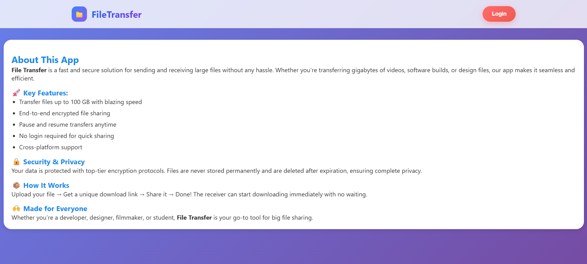
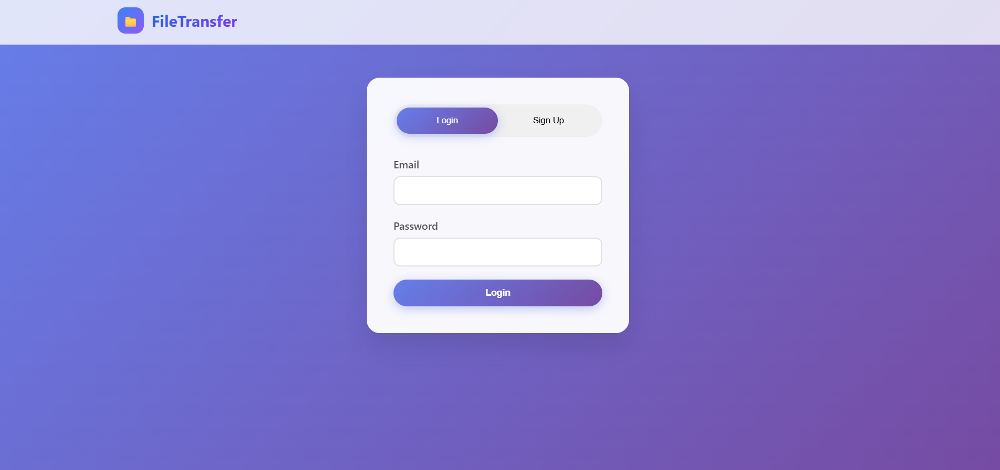
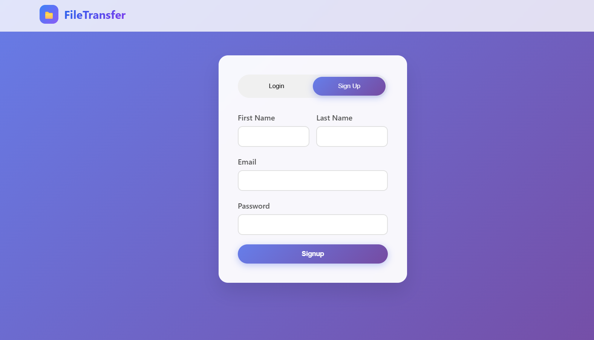
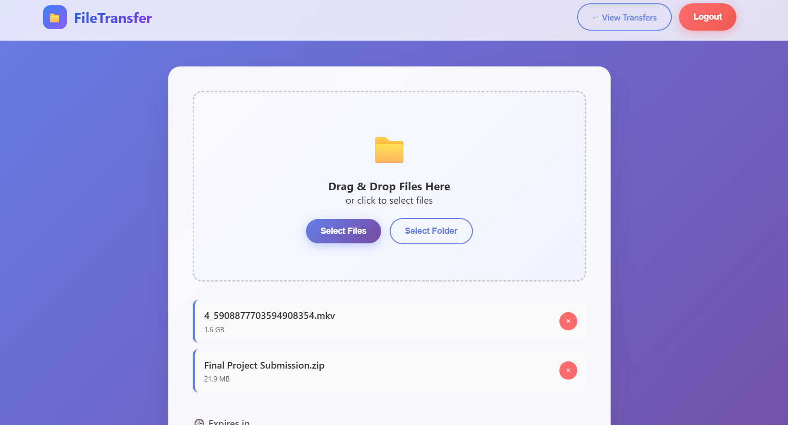
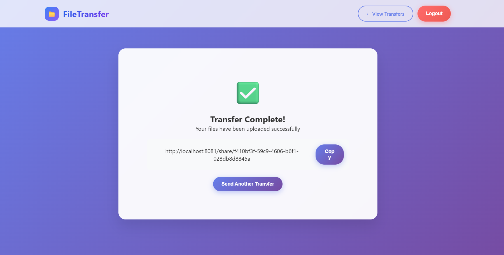
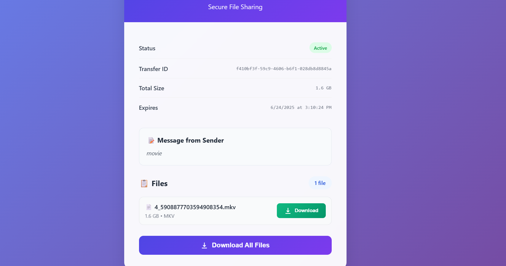
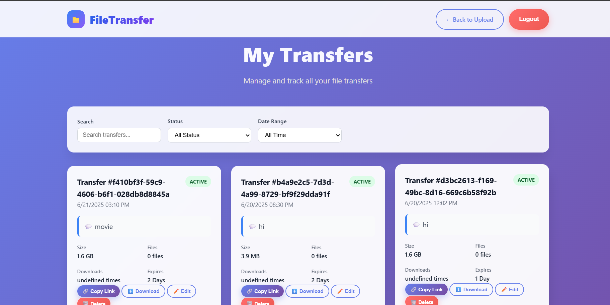

# 📁 Secure File Sharing System

## Overview

**Secure File Sharing System** is a robust backend service for uploading, sharing, and downloading large files securely. It supports user authentication, chunked uploads for reliability, public and protected download links, and automatic cleanup of expired or incomplete transfers. Built with Go and Gin, it ensures high performance and security for modern file transfer needs.

---

## Features

- **User Authentication**: Secure signup and login with JWT-based sessions.
- **Chunked File Uploads**: Upload large files in chunks for reliability and resumability.
- **Transfer Creation & Sharing**: Generate unique links for sharing files with others.
- **Public & Protected Endpoints**: Public download links and protected user management.
- **Automatic Cleanup**: Scheduled removal of expired or failed transfers.
- **Local File Storage**: Files are stored securely on the server (S3 support planned).
- **Transfer Expiry**: Set custom expiry times for each transfer.
- **Download as ZIP**: Download single files or entire transfers as ZIP archives.

---

## Tech Stack

- **Language**: Go (Golang)
- **Web Framework**: [Gin](https://github.com/gin-gonic/gin)
- **Database**: PostgreSQL
- **ORM**: [sqlx](https://github.com/jmoiron/sqlx)
- **Authentication**: JWT (JSON Web Tokens)
- **Task Scheduling**: [robfig/cron](https://github.com/robfig/cron)
- **File Storage**: Local filesystem (Amazon S3 support available)
- **Frontend**: HTML, CSS, JavaScript (see `/static` and `/templates`)

---

## Getting Started

### Prerequisites

- Go 1.18+
- PostgreSQL
- Node.js (for frontend development, optional)
- [Git](https://git-scm.com/)

### Installation

1. **Clone the repository**
   ```sh
   git clone https://github.com/yourusername/secure-file-sharing.git
   cd secure-file-sharing
   ```

2. **Set up environment variables**
   - Copy `.env.example` to `.env` and fill in your values (see below).

3. **Install Go dependencies**
   ```sh
   go mod download
   ```

4. **Install and Start Docker**

5. **Set Docker Environment**
   - docker-compose up -d

6. **Run the server**
   ```sh
   go run cmd/main.go
   ```
   The server will start at [http://localhost:8081](http://localhost:8081).

6. **(Optional) Frontend**
   - Static files are served from `/static`.
   - HTML templates are in `/templates`.

---

## API Endpoints

### Public Endpoints

| Method | Endpoint                                 | Description                       |
|--------|------------------------------------------|-----------------------------------|
| POST   | `/api/login`                             | User login                        |
| POST   | `/api/signup`                            | User signup                       |
| GET    | `/api/transfer/share/:transferid`        | Get transfer info (public link)   |
| GET    | `/api/transfer/download/file/:fileid`    | Download a single file            |
| GET    | `/api/transfer/download/transfer/:transferid` | Download all files as ZIP   |

### Protected Endpoints (require JWT)

All protected endpoints are under `/api/auth/transfer` and require the `auth_token` cookie or header.

| Method | Endpoint                        | Description                        |
|--------|---------------------------------|------------------------------------|
| POST   | `/new`                          | Create a new transfer              |
| POST   | `/upload`                       | Upload a file chunk                |
| POST   | `/assemble`                     | Finalize and assemble uploaded chunks |
| POST   | `/cancel`                       | Cancel an in-progress transfer     |
| GET    | `/successchunk/:transferid`     | Get list of uploaded chunk indices |
| DELETE | `/delete/:transferid`           | Delete a transfer                  |
| GET    | `/all`                          | List all transfers for the user    |
| PUT    | `/update`                       | Update transfer details            |

---

## Environment Variables

| Variable         | Description                                 |
|------------------|---------------------------------------------|
| `DBURL(constants)`| PostgreSQL connection string                |
| `JWT_SECRET(.env)`| Secret key for JWT signing                  |
| `PORT(constants)` | Port to run the server (default: 8081)      |
| `S3_BUCKET`      | (Optional) S3 bucket name for cloud storage |
| `S3_REGION`      | (Optional) AWS region for S3                |
| `S3_ACCESS_KEY`  | (Optional) AWS access key                   |
| `S3_SECRET_KEY`  | (Optional) AWS secret key                   |

---

## Folder Structure

```
.
├── cmd/                # Application entry point (main.go)
├── internals/
│   ├── constants/      # App and file constants
│   ├── customErrors/   # Custom error definitions
│   ├── dto/            # Data transfer objects (DTOs)
│   ├── handlers/       # HTTP route handlers (v1/)
│   ├── middleware/     # Gin middleware (auth, etc.)
│   ├── models/         # Database and API models
│   ├── repository/     # Database access logic
│   ├── services/       # Business logic (upload, download, cleanup)
│   └── storage/        # Storage abstraction (local, S3)
├── Local_storage/      # Local file storage (uploads, chunks, temp)
├── static/             # Static frontend assets (JS, CSS)
├── templates/          # HTML templates for frontend
├── .env                # Environment variables
├── go.mod, go.sum      # Go module files
└── README.md           # Project documentation
```

---

## Screenshots

> _Add screenshots of the login page, upload form, and share/download page here._










---

## Future Improvements

- **Cloud Storage**: Full support for Amazon S3 and other providers.
- **Email OTP Verification**: For enhanced account security.
- **Transfer Analytics**: Track downloads and access logs.
- **Multi-file & Folder Upload**: Improved UI for batch uploads.
- **Admin Dashboard**: Manage users and transfers.
- **Rate Limiting & Abuse Prevention**: Throttling and monitoring.

---

## License

This project is licensed under the [MIT License](LICENSE).

---

## Contributors & Acknowledgments

- [Lokesh](https://github.com/Lokslucifer)
- Thanks to the Go, Gin, and open-source communities for their libraries and inspiration.
